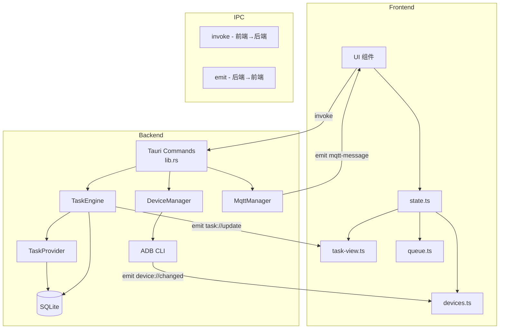

# AutomateX 系统架构

> **版本**: v1.0.2-STABLE | **最后更新**: 2026-03-01

## 1. 项目概览

**AutomateX** 是一个基于 Tauri v2 构建的跨平台桌面应用，用于批量管理 Android 设备并自动执行关键词任务。支持 WiFi/USB 设备连接、任务调度引擎、MQTT 消息通信和 SQLite 本地持久化。

### 核心能力

| 功能       | 描述                                                   |
| ---------- | ------------------------------------------------------ |
| 设备管理   | WiFi/USB 设备自动发现、连接、监控（电量/温度）         |
| 任务调度   | 多任务并发执行，支持启动/暂停/恢复/停止/重试           |
| 进度追踪   | 城市 → 关键词两级进度，断点续传                        |
| MQTT 通信  | 可配置 MQTT Broker，实时收发消息                       |
| 数据持久化 | SQLite WAL 模式，读写分离，设备/任务/进度/设置全持久化 |
| 跨平台 UI  | macOS 圆角窗口 + 交通灯按钮 / Windows 方块控制按钮     |

## 2. 技术栈

```
┌─────────────────────────────────────────────┐
│              Frontend (WebView)             │
│  TypeScript · Tailwind CSS v4 · Vite        │
│  SortableJS · Material Symbols             │
├─────────────────────────────────────────────┤
│           Tauri v2 IPC Bridge               │
│     Commands (invoke) · Events (emit)       │
├─────────────────────────────────────────────┤
│              Backend (Rust)                 │
│  Tokio · rusqlite · rumqttc · adb_client   │
│  chrono · serde_json                        │
└─────────────────────────────────────────────┘
```

| 层         | 技术                        | 版本             |
| ---------- | --------------------------- | ---------------- |
| 前端框架   | Vite + TypeScript           | Vite 6.x, TS 5.6 |
| CSS 方案   | Tailwind CSS v4 (CSS-first) | 4.2              |
| 桌面框架   | Tauri v2                    | 2.10             |
| 后端语言   | Rust                        | 2021 Edition     |
| 异步运行时 | Tokio                       | 1.x              |
| 数据库     | rusqlite (bundled SQLite)   | 0.31             |
| MQTT       | rumqttc                     | 0.24             |
| ADB        | adb_client + CLI sidecar    | 3.1              |

## 3. 目录结构

```
automatex/
├── backends/                 # Rust 后端（Tauri 核心）
│   ├── src/
│   │   ├── main.rs           # 入口
│   │   ├── lib.rs            # Tauri Commands + 应用初始化
│   │   ├── connection.rs     # ADB 设备连接管理
│   │   ├── storage.rs        # SQLite 数据库层
│   │   ├── task_engine.rs    # 异步任务调度引擎
│   │   ├── task_provider.rs  # 任务定义加载
│   │   ├── mqtt.rs           # MQTT 客户端管理
│   │   └── constants.rs      # 状态常量定义
│   ├── resources/
│   │   └── mock_tasks.json   # 任务定义文件
│   ├── capabilities/
│   │   └── default.json      # Tauri 权限声明
│   ├── tauri.conf.json       # Tauri 应用配置
│   └── Cargo.toml
├── frontends/                # TypeScript 前端
│   ├── main.ts               # 入口 + 初始化 + 主题
│   ├── state.ts              # 全局状态管理
│   ├── types.ts              # 类型定义
│   ├── constants.ts          # 状态常量（镜像后端）
│   ├── devices.ts            # 设备列表渲染
│   ├── queue.ts              # 任务队列渲染
│   ├── task-view.ts          # 任务详情渲染
│   ├── task-engine.ts        # 引擎事件桥接
│   ├── dialogs.ts            # 对话框逻辑
│   ├── settings.ts           # 设置面板逻辑
│   ├── utils.ts              # 工具函数
│   └── styles.css            # Tailwind v4 样式
├── scripts/
│   ├── build-macos.sh        # macOS 构建脚本
│   └── build-windows.sh      # Windows 交叉编译脚本
├── index.html                # SPA 入口
├── vite.config.ts            # Vite 配置
├── tsconfig.json             # TypeScript 配置
└── package.json              # Node 依赖
```

## 4. 数据流架构



## 5. 核心设计决策

### 5.1 循环依赖解决方案

前端模块间存在循环调用（如 `devices.ts` 需要刷新任务，`task-view.ts` 需要刷新设备卡片）。采用 **回调注册模式** 解决：

```typescript
// devices.ts - 声明回调槽
let _onLoadTasksForDevice: ((serial: string) => void) | null = null;
export function setDeviceCallbacks(onLoadTasks: ...) { ... }

// main.ts - 初始化时注册
setDeviceCallbacks(
    (serial) => loadTasksForDevice(serial),
    (serial) => showDeviceInfo(serial)
);
```

### 5.2 状态常量同步

前后端共享同一套状态字面量，分别在 `constants.rs` (Rust) 和 `constants.ts` (TS) 中定义。修改时需同步更新两侧。

### 5.3 跨平台窗口策略

- **全平台**: `decorations: false`，前端完全控制窗口外观
- **macOS**: 自定义交通灯按钮（🔴🟡🟢）+ 圆角窗口（`transparent: true`）
- **Windows**: 方块控制按钮（─ □ ✕）+ 直角窗口

### 5.4 任务引擎的锁策略

`TaskEngine` 使用 `tokio::sync::RwLock` 管理任务列表，采用 **TickEffect 模式**：先在写锁内计算副作用，释放写锁后再执行 DB 操作，避免死锁。
