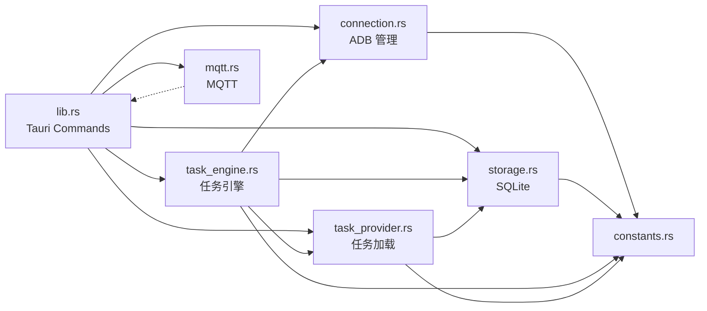

# 后端架构详解

> 后端采用 Rust + Tauri v2 构建，所有业务逻辑在 Rust 进程中执行，通过 Tauri Commands (IPC) 暴露给前端。

## 1. 模块依赖关系



## 2. 应用状态 (`AppState`)

全局状态通过 Tauri 的 `State` 机制管理，使用 `Arc` + `Mutex`/`RwLock` 实现线程安全：

```rust
struct AppState {
    db: Arc<Database>,          // SQLite 持久层
    device_mgr: DeviceManager,  // ADB 设备管理器
    mqtt_mgr: MqttManager,      // MQTT 客户端
    engine: Arc<TaskEngine>,    // 任务调度引擎
}
```

## 3. 模块详解

### 3.1 `connection.rs` — ADB 设备管理

核心职责：封装 ADB CLI 操作，管理设备连接。

| 方法                          | 功能                                |
| ----------------------------- | ----------------------------------- |
| `build_wifi_entry()`          | 构建 WiFi 设备条目（解析地址/端口） |
| `connect_wifi_via_adb()`      | 通过 ADB CLI 连接 WiFi 设备         |
| `disconnect_wifi()`           | 断开 WiFi 设备连接                  |
| `execute_shell()`             | 远程执行 shell 命令                 |
| `install_apk()`               | 安装 APK 到设备                     |
| `reboot_device()`             | 重启设备                            |
| `push_file()` / `pull_file()` | 文件传输                            |

**关键设计**：

- **Sidecar ADB**: 使用 Tauri `externalBin` 内嵌 ADB 可执行文件
- **超时保护**: `run_adb_timed()` 对所有 ADB 命令添加超时（默认 30s），防止进程永久阻塞
- **Windows 兼容**: `adb_command()` 在 Windows 上设置 `CREATE_NO_WINDOW` 防止弹出控制台
- **OnceLock 缓存**: ADB 路径通过 `OnceLock` 缓存，只查找一次

### 3.2 `storage.rs` — SQLite 持久化层

核心职责：管理所有数据的持久化存储。

**数据库架构**：

- WAL 模式：支持并发读写
- 读写分离：`w()` 写连接 + `r()` 读连接
- `Mutex<Connection>` 保护连接安全

**数据表**：

| 表名              | 用途           | 关键字段                                          |
| ----------------- | -------------- | ------------------------------------------------- |
| `a_devices`       | 设备信息       | serial, state, battery_level, battery_temperature |
| `a_settings`      | 键值设置       | key, value                                        |
| `a_task_cache`    | 任务定义缓存   | task_id, name, payload, version                   |
| `a_task_state`    | 任务运行状态   | task_id, status, assigned_device                  |
| `a_task_progress` | 关键词执行进度 | task_id, city_name, keyword_name, status          |
| `a_task_runs`     | 执行记录       | task_id, device_serial, started_at, ended_at      |
| `a_daily_stats`   | 每日统计       | device_serial, run_date, keywords_done            |
| `a_city_order`    | 城市排序       | task_id, order_json                               |

**关键数据结构**：

```rust
pub struct DeviceRow {
    pub serial: String,
    pub hw_serial: String,
    pub name: String,
    pub device_type: String,    // "usb" | "wifi"
    pub address: Option<String>,
    pub state: String,          // "Device" | "Offline"
    pub model: String,
    pub brand: String,
    pub android_version: String,
    pub sdk_version: String,
    pub display_resolution: String,
    pub battery_level: i32,
    pub battery_temperature: f64,
    pub updated_at: i64,
}
```

### 3.3 `task_engine.rs` — 异步任务调度引擎

核心职责：管理任务生命周期，调度设备执行关键词。

**任务生命周期**：

```
WAITING ──start──▶ EXECUTING ──pause──▶ PAUSED
  ▲                    │                   │
  │ stop               │ 全部完成          │ resume
  ◀────────────────────▼                   ▼
                    SUCCESS          EXECUTING
                       │
                       │ retry
                       ▼
                    WAITING
```

**核心机制**：

1. **Tick 循环**: 每个执行任务启动独立 `tokio::spawn` 循环，每 tick 推进一个关键词
2. **TickEffect 模式**: tick 在 `RwLock` 写锁内计算副作用（`TickEffect`），释放锁后再执行 DB 写入
3. **CancellationToken**: 暂停/停止任务通过 `tokio_util::CancellationToken` 优雅取消
4. **设备分配**: `pick_ready_serial()` 从在线设备中选择未被占用的设备

```rust
enum TickEffect {
    TaskStart { task_id, device, run_id, started_at },
    KeywordDone { task_id, city, keyword, run_id },
    TaskSuccess { task_id, run_id },
    None,
}
```

**任务操作 API**：

| 方法                        | 功能                               |
| --------------------------- | ---------------------------------- |
| `start_task()`              | 分配设备 → 启动循环 → 保存状态     |
| `pause_task()`              | 取消循环 → 保存暂停状态            |
| `resume_task()`             | 重新分配设备 → 启动循环            |
| `stop_task()`               | 取消循环 → 清除进度 → 回到 WAITING |
| `retry_task()`              | 清除进度 → 重新启动                |
| `release_offline_devices()` | 释放离线设备上的任务               |

### 3.4 `task_provider.rs` — 任务定义管理

核心职责：从嵌入资源加载任务定义，合并 DB 进度，构建前端需要的 `Task` 数据。

**数据模型**：

```rust
pub struct Task {
    pub id: String,
    pub name: String,
    pub status: String,              // WAITING | EXECUTING | PAUSED | SUCCESS | ERROR
    pub assigned_device: Option<String>,
    pub cities: Vec<TaskCity>,
}

pub struct TaskCity {
    pub name: String,
    pub poi: String,
    pub progress: i32,               // 0-100
    pub total: i32,
    pub done: i32,
    pub status: String,              // pending | active | done
    pub keywords: Vec<TaskKeyword>,
}
```

**加载流程**：

1. `load_mock_definitions()` — 从 `resources/mock_tasks.json` 读取定义（`OnceLock` 缓存）
2. `build_task()` — 合并 DB 中的执行进度
3. 重排城市顺序（根据用户自定义排序）
4. 推断任务状态（WAITING/PAUSED/SUCCESS）
5. 应用 DB 保存的运行时状态覆盖

### 3.5 `mqtt.rs` — MQTT 通信

核心职责：管理与 MQTT Broker 的连接、订阅和消息收发。

**连接管理**：

- 使用 `rumqttc::AsyncClient` 异步客户端
- 事件循环通过 `tokio::spawn` 在后台运行
- `watch::channel` 实现优雅取消
- 自动重连（rumqttc 内置）

**事件推送到前端**：

| 事件     | 前端事件名                          | 触发时机          |
| -------- | ----------------------------------- | ----------------- |
| 连接成功 | `mqtt-status` = "connected"         | ConnAck           |
| 收到消息 | `mqtt-message` = `{topic, payload}` | Incoming::Publish |
| 连接断开 | `mqtt-status` = "disconnected"      | Disconnect        |
| 连接错误 | `mqtt-status` = "error:..."         | Poll Error        |

### 3.6 `constants.rs` — 状态常量

集中管理所有状态字面量和配置常量：

| 模块             | 常量                                       |
| ---------------- | ------------------------------------------ |
| `task_status`    | WAITING, EXECUTING, PAUSED, SUCCESS, ERROR |
| `city_status`    | pending, active, done                      |
| `keyword_status` | pending, run, ok                           |
| `device_state`   | Offline, Device, unknown                   |
| `timing`         | 电池刷新间隔、ADB 超时、MQTT keep-alive 等 |
| `limits`         | 设备属性获取并发数、电池刷新并发数         |
| `settings`       | 允许保存的设置键白名单                     |

## 4. Tauri Commands 完整列表

### 设备管理

| Command           | 签名                               | 说明           |
| ----------------- | ---------------------------------- | -------------- |
| `add_device`      | `(address, name) → String`         | 添加 WiFi 设备 |
| `remove_device`   | `(serial) → String`                | 移除设备       |
| `list_devices`    | `() → Vec<DeviceRow>`              | 列出所有设备   |
| `get_device_info` | `(serial) → DeviceRow`             | 获取设备详情   |
| `execute_shell`   | `(serial, command) → ShellResult`  | 远程 shell     |
| `install_apk`     | `(serial, apk_path) → String`      | 安装 APK       |
| `reboot_device`   | `(serial) → String`                | 重启设备       |
| `push_file`       | `(serial, local, remote) → String` | 推送文件       |
| `pull_file`       | `(serial, remote, local) → String` | 拉取文件       |

### 设置管理

| Command         | 签名                  | 说明     |
| --------------- | --------------------- | -------- |
| `get_settings`  | `() → JSON`           | 读取设置 |
| `save_settings` | `(settings) → String` | 保存设置 |

### MQTT

| Command           | 签名                        | 说明      |
| ----------------- | --------------------------- | --------- |
| `mqtt_connect`    | `() → String`               | 连接 MQTT |
| `mqtt_disconnect` | `() → String`               | 断开 MQTT |
| `mqtt_subscribe`  | `(topic) → String`          | 订阅主题  |
| `mqtt_publish`    | `(topic, payload) → String` | 发布消息  |
| `mqtt_status`     | `() → String`               | 查询状态  |

### 任务引擎

| Command                  | 签名                      | 说明         |
| ------------------------ | ------------------------- | ------------ |
| `engine_get_tasks`       | `() → Vec<Task>`          | 获取任务列表 |
| `engine_start_task`      | `(taskId) → ()`           | 启动任务     |
| `engine_pause_task`      | `(taskId) → ()`           | 暂停任务     |
| `engine_resume_task`     | `(taskId) → ()`           | 恢复任务     |
| `engine_stop_task`       | `(taskId) → ()`           | 停止任务     |
| `engine_retry_task`      | `(taskId) → ()`           | 重试任务     |
| `engine_release_offline` | `(onlineSerials) → u32`   | 释放离线设备 |
| `engine_reorder_cities`  | `(taskId, newOrder) → ()` | 重排城市     |

### 统计查询

| Command               | 签名                                 | 说明           |
| --------------------- | ------------------------------------ | -------------- |
| `list_tasks`          | `() → Vec<Task>`                     | 任务列表（DB） |
| `get_task_detail`     | `(taskId) → Task`                    | 任务详情       |
| `get_daily_stats`     | `(serial, date) → Vec<DailyStatRow>` | 每日统计       |
| `get_daily_summary`   | `(date) → DailySummary`              | 每日概况       |
| `get_task_run_stats`  | `(taskId) → TaskRunStats`            | 任务执行统计   |
| `clear_task_progress` | `(taskId) → String`                  | 清除进度       |

## 5. 并发安全设计

| 资源               | 保护方式            | 原因                        |
| ------------------ | ------------------- | --------------------------- |
| SQLite 写连接      | `Mutex<Connection>` | 写操作必须串行              |
| SQLite 读连接      | `Mutex<Connection>` | rusqlite Connection 非 Sync |
| TaskEngine.tasks   | `RwLock<Vec<Task>>` | 读多写少                    |
| TaskEngine.running | `RwLock<HashMap>`   | 管理运行中任务              |
| MqttManager 各字段 | `tokio::Mutex`      | 异步上下文                  |
| 全局线程计数器     | `AtomicUsize`       | 限制并发线程数              |
