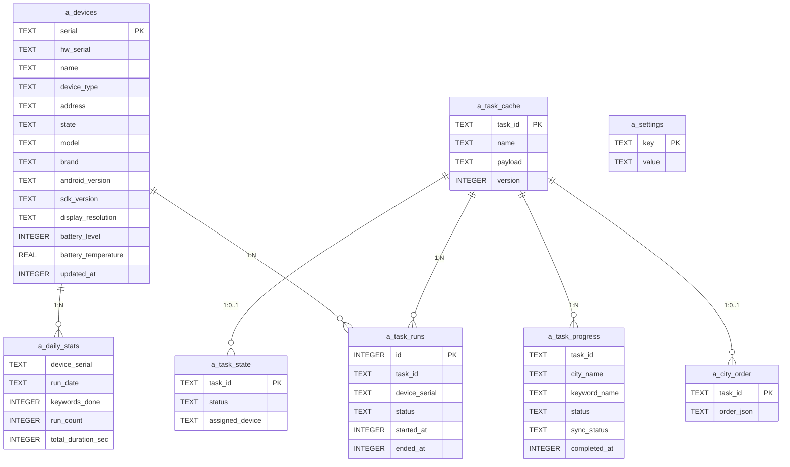

# 数据模型

> 完整描述 AutomateX 系统中的所有数据结构，包括后端 Rust 结构体、数据库表、前端 TypeScript 接口的映射关系。

## 1. 数据模型总览



## 2. 前后端类型映射

### 2.1 设备 (Device)

| Rust struct | TS interface | DB 表       |
| ----------- | ------------ | ----------- |
| `DeviceRow` | `DeviceRow`  | `a_devices` |

```rust
// Rust (storage.rs)
pub struct DeviceRow {
    pub serial: String,              // 主键，WiFi: "IP:PORT"
    pub hw_serial: String,           // 硬件序列号
    pub name: String,                // 用户自定义名称
    pub device_type: String,         // "usb" | "wifi"
    pub address: Option<String>,     // WiFi 地址
    pub state: String,               // "Device" | "Offline"
    pub model: String,
    pub brand: String,
    pub android_version: String,
    pub sdk_version: String,
    pub display_resolution: String,
    pub battery_level: i32,          // 0-100
    pub battery_temperature: f64,    // 摄氏度
    pub updated_at: i64,             // Unix 时间戳
}
```

```typescript
// TypeScript (types.ts)
export interface DeviceRow {
    serial: string;
    hw_serial: string;
    name: string;
    device_type: string;
    address: string | null;
    state: string;
    model: string;
    brand: string;
    android_version: string;
    sdk_version: string;
    display_resolution: string;
    battery_level: number;
    battery_temperature: number;
    updated_at: number;
}
```

### 2.2 任务 (Task)

| Rust struct   | TS interface  | 说明           |
| ------------- | ------------- | -------------- |
| `Task`        | `Task`        | 任务根对象     |
| `TaskCity`    | `TaskCity`    | 城市（二级）   |
| `TaskKeyword` | `TaskKeyword` | 关键词（三级） |

```
Task
  ├── id, name, status, assigned_device
  └── cities[]
        ├── name, poi, progress, total, done, status
        └── keywords[]
              ├── name, status
```

### 2.3 任务运行统计 (TaskRunStats)

```rust
pub struct TaskRunStats {
    pub last_run_at: Option<i64>,
    pub today_runs: i32,
    pub today_duration_sec: i64,
    pub today_keywords: i32,
}
```

### 2.4 每日统计 (DailyStatRow / DailySummary)

```rust
pub struct DailyStatRow {
    pub device_serial: String,
    pub keywords_done: i32,
    pub run_count: i32,
    pub total_duration_sec: i64,
}

pub struct DailySummary {
    pub total_keywords: i32,
    pub total_runs: i32,
    pub total_duration_sec: i64,
    pub device_count: i32,
}
```

## 3. 状态枚举

### 3.1 任务状态 (TaskStatus)

| 值          | Rust 常量                | TS 常量                | 含义     |
| ----------- | ------------------------ | ---------------------- | -------- |
| `WAITING`   | `task_status::WAITING`   | `TaskStatus.WAITING`   | 等待启动 |
| `EXECUTING` | `task_status::EXECUTING` | `TaskStatus.EXECUTING` | 正在执行 |
| `PAUSED`    | `task_status::PAUSED`    | `TaskStatus.PAUSED`    | 已暂停   |
| `SUCCESS`   | `task_status::SUCCESS`   | `TaskStatus.SUCCESS`   | 全部完成 |
| `ERROR`     | `task_status::ERROR`     | `TaskStatus.ERROR`     | 执行出错 |

### 3.2 城市状态 (CityStatus)

| 值        | 含义                 |
| --------- | -------------------- |
| `pending` | 未开始               |
| `active`  | 正在执行（当前城市） |
| `done`    | 已全部完成           |

### 3.3 关键词状态 (KeywordStatus)

| 值        | 含义     |
| --------- | -------- |
| `pending` | 未开始   |
| `run`     | 正在执行 |
| `ok`      | 已完成   |

### 3.4 设备状态 (DeviceState)

| 值        | 含义     |
| --------- | -------- |
| `Device`  | 在线就绪 |
| `Offline` | 离线     |

### 3.5 执行记录状态 (RunStatus)

| 值          | 含义     |
| ----------- | -------- |
| `running`   | 正在运行 |
| `completed` | 正常完成 |
| `stopped`   | 被停止   |
| `paused`    | 被暂停   |

### 3.6 MQTT 状态 (MqttStatus)

| 值              | 含义     |
| --------------- | -------- |
| `Disconnected`  | 未连接   |
| `Connecting`    | 连接中   |
| `Connected`     | 已连接   |
| `Error(String)` | 连接错误 |

## 4. 配置数据

### 设置键白名单 (a_settings)

| Key              | 类型   | 默认值              | 说明                |
| ---------------- | ------ | ------------------- | ------------------- |
| `mqtt_host`      | String | `"127.0.0.1"`       | MQTT 服务器地址     |
| `mqtt_port`      | String | `"1883"`            | MQTT 端口号         |
| `mqtt_client_id` | String | `"automatex-{pid}"` | MQTT 客户端 ID      |
| `mqtt_username`  | String | `""`                | MQTT 用户名（可选） |
| `mqtt_password`  | String | `""`                | MQTT 密码（可选）   |

## 5. 时间常量

| 常量                            | 值     | 说明                             |
| ------------------------------- | ------ | -------------------------------- |
| `BATTERY_REFRESH_INTERVAL_SECS` | 20s    | 电池/温度定时刷新间隔            |
| `ADB_RECONNECT_WAIT_SECS`       | 5s     | ADB track_devices 断开后重连等待 |
| `WIFI_CONNECT_TIMEOUT_SECS`     | 5s     | WiFi 设备连接超时                |
| `MQTT_KEEP_ALIVE_SECS`          | 30s    | MQTT keep-alive 间隔             |
| `ADB_COMMAND_TIMEOUT_SECS`      | 30s    | ADB 命令执行超时                 |
| `DEVICE_CACHE_TTL_MS`           | 3000ms | 设备列表缓存 TTL                 |

## 6. 并发限制

| 常量                          | 值  | 说明                       |
| ----------------------------- | --- | -------------------------- |
| `MAX_PROP_FETCH_THREADS`      | 4   | 设备属性获取最大并发线程数 |
| `MAX_BATTERY_REFRESH_THREADS` | 8   | 电池刷新最大并发线程数     |
