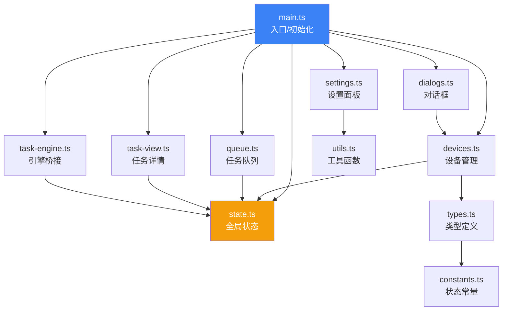

# 前端架构详解

> 前端基于 TypeScript + Tailwind CSS v4 构建，使用 Vite 作为构建工具，通过 Tauri IPC 与后端通信。

## 1. 模块依赖关系



## 2. 模块详解

### 2.1 `main.ts` — 应用入口

**职责**: 初始化、主题切换、开屏动画、平台适配

**初始化流程**:

```
DOMContentLoaded
  ├── initTheme() + syncWindowBg()      → 初始化主题 + 同步窗口背景色
  ├── 平台检测                            → 显示 macOS 交通灯 / Windows 方块按钮
  ├── setRefreshCallbacks()              → 注册刷新回调（打破循环依赖）
  ├── setDeviceCallbacks()               → 注册设备回调
  ├── setTaskViewCallbacks()             → 注册任务视图回调
  ├── initEngine()                       → 初始化后端引擎事件监听
  ├── registerTaskActions()              → 注册任务操作到 window
  ├── registerViewActions()              → 注册视图切换回调
  ├── splash()                           → 启动开屏动画
  ├── 绑定对话框/设置/设备操作事件
  ├── ADB 设备监听 (track-devices)       → 实时同步设备状态
  └── MQTT 状态监听                      → 更新 UI 状态
```

**主题系统**:

- 存储: `localStorage.theme` = `'dark'` | `'light'`
- CSS: `html.dark` 类驱动 Tailwind v4 暗色模式
- 窗口: `syncWindowBg()` 调用 `Window.setBackgroundColor()` 同步窗口底色

### 2.2 `state.ts` — 全局状态管理

集中管理所有前端状态，避免分散在各模块中：

| 状态             | 类型             | 说明                  |
| ---------------- | ---------------- | --------------------- |
| `selectedDevice` | `string \| null` | 当前选中的设备 serial |
| `globalQueue`    | `Task[]`         | 全局任务队列          |
| `activeTask`     | `Task \| null`   | 当前查看的任务        |
| `activeCityIdx`  | `number`         | 当前选中的城市索引    |
| `cachedDevices`  | `DeviceRow[]`    | 缓存的设备列表        |

**派生状态**:

- `getAssignedDeviceSerials()` — 获取正在执行任务的设备 serial 集合
- `getDeviceBySerial()` — 根据 serial 查找设备

### 2.3 `devices.ts` — 设备列表与卡片

**职责**: 从后端加载设备列表、渲染设备卡片、处理设备选择

**渲染策略**: 根据设备状态渲染三种卡片样式：

- `renderRunningCard()` — 执行中设备（蓝色边框 + 脉冲动画）
- `renderReadyCard()` — 就绪设备（绿色状态点）
- `renderOfflineCard()` — 离线设备（灰色半透明）

**分组逻辑**:

```
设备列表
  ├── 🔵 执行中 (EXECUTING + 已分配设备)
  ├── 🟢 就绪 (Device 状态 + 未被占用)
  └── ⚪ 离线 (Offline 状态)
```

### 2.4 `queue.ts` — 任务队列（左栏）

**职责**: 渲染任务链卡片列表

**优化**:

- `_lastQueueHtml` 缓存上次渲染内容，跳过无变化刷新
- 卡片展示：任务名、状态 badge、进度条、分配设备标签

### 2.5 `task-view.ts` — 任务详情（中栏）

**职责**: 渲染任务详情页（Header + 统计指标 + 城市卡片 + 关键词网格）

**分区更新策略**（高性能）：

```
task-view
  ├── #tv-header     → 任务标题 + 状态 badge + 操作按钮
  ├── #tv-metrics    → 今日关键词/执行次数/总进度/耗时
  ├── #tv-cities     → 城市卡片列表（可拖拽排序）
  ├── #tv-keywords   → 关键词网格
  └── #tv-kw-info    → 关键词统计信息
```

每个区域独立缓存 HTML，仅变化区域做 DOM 更新（`patchHtml()`），避免全量重渲染。

**城市拖拽排序**: 使用 SortableJS 实现城市卡片拖拽重排序，排序结果通过 `invoke('engine_reorder_cities')` 持久化。

**Task 操作按钮映射**:

| 状态      | 可用操作        |
| --------- | --------------- |
| WAITING   | ▶ 启动          |
| EXECUTING | ⏸ 暂停 / ⏹ 停止 |
| PAUSED    | ▶ 恢复 / ⏹ 停止 |
| SUCCESS   | 🔄 重试         |
| ERROR     | 🔄 重试         |

### 2.6 `task-engine.ts` — 引擎事件桥接

**职责**: 连接后端 TaskEngine 事件与前端状态

**核心机制**:

1. 监听 `task://update` 事件 → 更新 `globalQueue` + `activeTask`
2. 通过 `_onRefresh` 回调触发 UI 刷新
3. 将任务操作函数注册到 `window` 对象（供 HTML `onclick` 调用）

### 2.7 `dialogs.ts` — 对话框交互

三个对话框的逻辑：

- **添加设备**: 地址输入 → `invoke('add_device')` → 刷新列表
- **移除设备**: 确认 → `invoke('remove_device')` → 清除选中
- **设备详情**: 加载详情 → 渲染统计卡片 + 属性表格

### 2.8 `settings.ts` — 设置面板

MQTT Broker 配置界面：

- 加载/保存设置到后端 (`get_settings` / `save_settings`)
- MQTT 连接/断开控制
- 实时状态指示灯

### 2.9 `utils.ts` — 工具函数

| 函数              | 用途                             |
| ----------------- | -------------------------------- |
| `$()`             | DOM 选择器简写                   |
| `esc()`           | HTML 转义防 XSS                  |
| `timeAgo()`       | Unix 时间戳 → 中文相对时间       |
| `formatRunTime()` | 时间戳 → 日期/时间格式           |
| `getDeviceName()` | 设备显示名称（优先 brand+model） |
| `showToast()`     | 顶部 Toast 提示（3 秒自动消失）  |

## 3. CSS 设计系统 (Tailwind v4)

采用 Tailwind CSS v4 的 CSS-first 模式，通过 `@theme` 定义设计令牌：

```css
@theme {
    --color-premium-bg: #f8fafc;
    --color-deep-charcoal: #1e293b;
    --color-panel-border: #e2e8f0;
    --color-blue: #2563eb;
    /* ... */
}
```

### 暗色模式

通过 `html.dark` 类和 CSS 变量覆盖实现：

```css
.dark {
    --color-premium-bg: #0f1117;
    --color-deep-charcoal: #e2e8f0;
    /* ... */
}
```

### 动画系统

| 动画                | 用途           |
| ------------------- | -------------- |
| `sharingan-spin`    | 开屏写轮眼旋转 |
| `splash-glow-pulse` | 开屏光晕脉冲   |
| `btn-pulse`         | 按钮脉冲效果   |
| `shimmer-sweep`     | 光带扫描效果   |
| `particle-float`    | 浮动粒子       |

## 4. IPC 通信模式

### 前端 → 后端 (invoke)

```typescript
const result = await invoke<DeviceRow>('get_device_info', { serial: 'xxx' });
```

### 后端 → 前端 (事件)

```typescript
await listen<{ tasks: Task[] }>('task://update', event => {
    // 更新状态
});
```

### 事件清单

| 事件名             | 方向      | 负载                          | 触发者                   |
| ------------------ | --------- | ----------------------------- | ------------------------ |
| `task://update`    | 后端→前端 | `{ tasks: Task[] }`           | TaskEngine.emit_update() |
| `device://changed` | 后端→前端 | `{ devices: Vec<DeviceRow> }` | track_devices 循环       |
| `mqtt-status`      | 后端→前端 | `string`                      | MqttManager              |
| `mqtt-message`     | 后端→前端 | `{ topic, payload }`          | MqttManager              |
